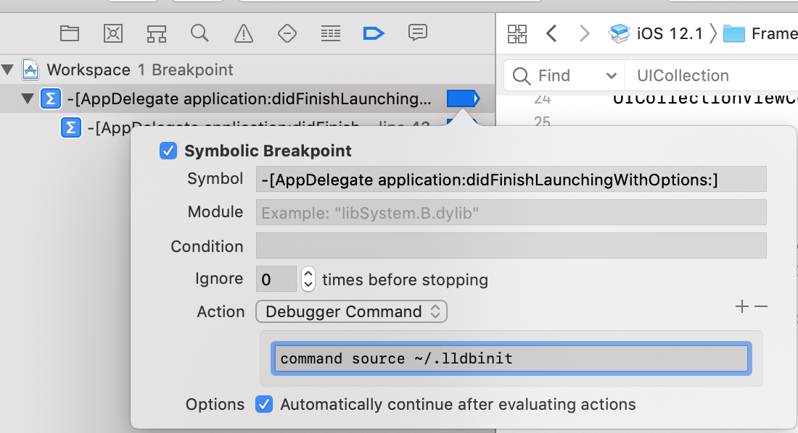
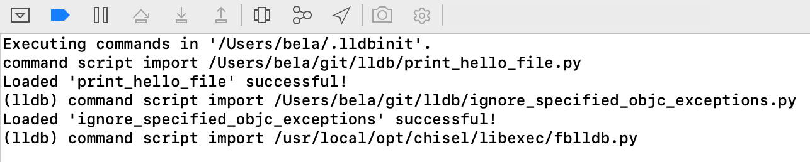
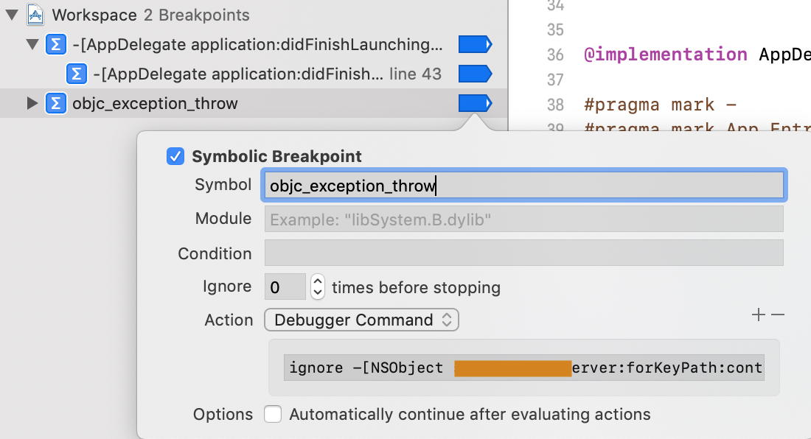

# lldb_ignore_exception
iOS debug helpers


## How can you use it?

#### Move files to correct location

Download the `ignore_exception.py` file.
Prepare your .libinit file to collect heleper imports:
> Create the `~/.lldbinit` if needed
```
touch ~/.lldbinit
```
```
echo ~/.lldbinit << {YOUR_LOCAL_PATH} ignore_exception.py
```

#### Load scrips on app start (skippable but not in my case)

In my option `lldb` doesn't load scripts from `~/.lldbinit` automatically, so I have to load for example with a `breakpoint`:
Create a `Symbolic Breakpoint` in Xcode project.
Set the `Symbol` in my case this is the `-[AppDelegate application:didFinishLaunchingWithOptions:]`
This will be the place where the breakbpont can make an action.

Set a `Debugger Command` with `command source ~/.lldbinit`.
> It will load your scripts what you place in your `~/.lldbinit` file.
Set the `Options` for skip automatically.

## Test scrips are loaded
You have to check it, with start your app and see the `Debugger Output` window in xcode.
You have to see something similar to this:


## Ignore an Exception
Create an other `Symbolic Breakpoint` with symbol: `objc_exception_throw`.




