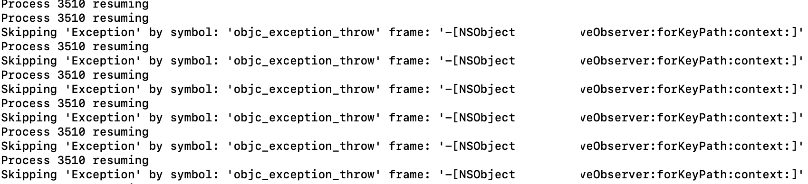

# LLDB Ignore Exception

iOS debug helper

I have to use exception breakpoint (for `NSAssert`s), but our code contains a legacy code with **exception managed programming**. 
So I want to make a useable case for me.
My script is iterating back on the stack and get all level of frame until the user defined classname and methode name not found. Finally it skip a complite part of code (under the selected methode) not only one exception.

My solution based on [this GitHub repo](https://gist.github.com/chendo/6759305).

## How can you use it?

#### Move files to correct location

Download the `ignore_exception.py` file.
Prepare your .libinit file to collect heleper imports:
> Create the `~/.lldbinit` if needed
```
touch ~/.lldbinit
```
```
echo "{YOUR_LOCAL_PATH} ignore_exception.py" >> ~/.lldbinit
```

#### Load scrips on app start (skippable but not in my case)

In my option `lldb` doesn't load scripts from `~/.lldbinit` automatically, so I have to load for example with a `breakpoint`:
Create a `Symbolic Breakpoint` in Xcode project.
Set the `Symbol` in my case this is the `-[AppDelegate application:didFinishLaunchingWithOptions:]`
This will be the place where the breakbpont can make an action.

Set a `Debugger Command` with `command source ~/.lldbinit`.
> It will load your scripts what you place in your `~/.lldbinit` file.
Set the `Options` for skip automatically.

## Test scrips are loaded
You have to check it, with start your app and see the `Debugger Output` window in xcode.
You have to see something similar to this:


## Ignore an Exception
Create an other `Symbolic Breakpoint` with symbol: `objc_exception_throw`.


Set a `Debugger Command` with `ignore {YOUR_CLASS} {YOUR_METHOR}`.

## Ignore an Exception output example 
You get a log similar to this if an Exception was skipped



